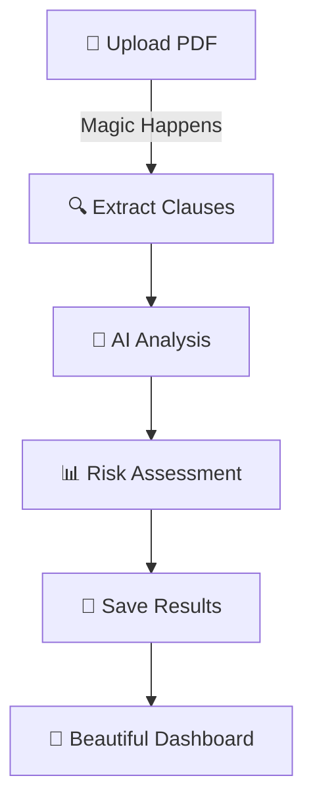

# ClauseIQ 🛡️

**AI-Powered Legal Clause Detection & Analysis Platform**

[](https://react.dev/)
[](https://fastapi.tiangolo.com/)
[](https://tailwindcss.com/)
[](LICENSE)

> *"Making legal documents accessible to everyone, one clause at a time."*

ClauseIQ transforms the intimidating world of legal documents into something anyone can understand. Whether you're a small business owner reviewing a contract, a student studying legal texts, or just someone who wants to know what they're actually signing, ClauseIQ has your back.

## 🚀 Live Demo

**[Try ClauseIQ Now →](https://clause-iq.vercel.app/)**

*No registration required - just upload a PDF and see the magic happen!*

## 📸 Screenshots

### Dashboard Overview

*Clean, intuitive interface showing document analysis results*

### AI-Powered Analysis

*Real-time clause detection with risk assessment and plain-English explanations*

## 🎯 Why ClauseIQ?

Ever found yourself staring at a legal document, wondering what all those complicated terms actually mean? You're not alone. Legal jargon can be overwhelming, and missing important clauses can be costly. That's exactly why I built ClauseIQ.

After spending countless hours helping friends and family decode contracts, NDAs, and legal agreements, I realized there had to be a better way. ClauseIQ was born from the simple idea that everyone deserves to understand what they're agreeing to, without needing a law degree.

## ✨ What Makes ClauseIQ Special

### 🔍 Smart Document Processing
- **Drag & Drop Simplicity**: Just drop your PDF and watch ClauseIQ work its magic
- **Lightning Fast**: Get results in seconds, not hours
- **Advanced Extraction**: Powered by PyMuPDF for accurate text extraction

### 🤖 AI That Actually Helps
- **Risk Assessment**: Automatically identifies potential red flags (Low/Medium/High risk)
- **Smart Categorization**: Organizes clauses by type (NDA, Liability, Payment, etc.)
- **Plain English**: Translates legal speak into language humans actually understand
- **Double-Checked Accuracy**: Multi-agent AI verification ensures reliable results

### 📊 Beautiful & Intuitive Interface
- **Color-Coded Risk Levels**: Spot concerning clauses at a glance
- **Document History**: Never lose track of your analyses
- **Dark Mode**: Easy on the eyes during late-night contract reviews
- **Mobile Friendly**: Works perfectly on your phone or tablet

## 🛠️ Built With Love Using

### Frontend Magic
- **React 19.1.0** - Because modern web apps deserve modern tools
- **Vite 7.0.0** - For blazingly fast development
- **Tailwind CSS 3.4.17** - Making beautiful UIs without the headaches
- **Lucide React 0.525.0** - Crisp, beautiful icons that don't get in the way

### Backend Powerhouse
- **FastAPI 0.104.1** - Python web framework that's both fast and elegant
- **PyMuPDF 1.23.8** - The PDF processing workhorse
- **OpenRouter API** - Connecting to Mistral 3.2-24B for world-class AI analysis

## 🏗️ How It All Works

Think of ClauseIQ as having three main superpowers:

1. **Document Vision**: Reads your PDF and extracts every meaningful clause
2. **AI Brain**: Analyzes each clause for risks and translates complex terms
3. **Memory**: Remembers everything so you can revisit analyses anytime


```mermaid
graph TD
    A[📄 Upload PDF] -->|Magic Happens| B[🔍 Extract Clauses]
    B --> C[🤖 AI Analysis]
    C --> D[📊 Risk Assessment]
    D --> E[💾 Save Results]
    E --> F[🎯 Beautiful Dashboard]
```

## 🚀 Get Started in 5 Minutes

### What You'll Need
- Node.js 18+ (the JavaScript runtime)
- Python 3.8+ (for the AI backend)
- An OpenRouter API key ([grab one here](https://openrouter.ai/) - it's free to start!)

### 1. Get the Code

```bash
git clone <your-repository-url>
cd ai-clause-detector
```

### 2. Set Up the Brain (Backend)

```bash
cd backend

# Create a clean Python environment
python -m venv venv
source venv/bin/activate  # Windows: venv\Scripts\activate

# Install all the smart stuff
pip install -r requirements.txt

# Add your secret sauce (API key)
echo "OPENROUTER_API_KEY=your_api_key_here" > .env

# Wake up the database
python -m app.init_db

# Start the AI engine
uvicorn app.main:app --reload --host 0.0.0.0 --port 8000
```

### 3. Fire Up the Interface (Frontend)

```bash
cd frontend

# Get all the web dependencies
npm install

# Launch the beautiful interface
npm run dev
```

**Boom! 🎉** You're ready to go:
- **Main App**: http://localhost:5173
- **API Playground**: http://localhost:8000/docs

## 📖 How to Use ClauseIQ

### Step 1: Upload Your Document
Click that big friendly "Upload New PDF" button or just drag your file right onto the page. ClauseIQ accepts PDFs up to 10MB (that's most contracts and agreements).

### Step 2: Watch the Magic
Sit back and watch as ClauseIQ:
- Extracts every important clause
- Assigns risk levels with color coding
- Categorizes each clause type
- Gets ready to explain anything you don't understand

### Step 3: Explore Your Results
- **Green clauses** = You're probably fine
- **Yellow clauses** = Worth a closer look
- **Red clauses** = Definitely pay attention to these
- Click "Smart Explain" on any clause for a human-friendly explanation

### Step 4: Keep Everything Organized
Your document history lives in the sidebar. Click on any previous analysis to revisit it instantly.

## 🌐 Deployment

### Live on the Web
ClaudeIQ is deployed and ready to use at: **[https://clause-iq.vercel.app/]**

The application is hosted using:
- **Frontend**: [Your hosting platform - Vercel.]
- **Backend**: [Your backend hosting - Render.]
  
### Deploy Your Own Instance

**Frontend (Static Hosting):**
```bash
cd frontend
npm run build
# Deploy the 'dist' folder to your favorite hosting service
```

**Backend (Server Hosting):**
```bash
cd backend
# Most platforms auto-detect Python apps
# Just point them to: uvicorn app.main:app --host 0.0.0.0 --port $PORT
```

Popular deployment options:
- **Frontend**: Vercel, Netlify, GitHub Pages
- **Backend**: Railway, Render, Heroku, DigitalOcean

## 🎯 What's Coming Next

I'm constantly working to make ClauseIQ even better. Here's what's on the roadmap:

### Coming Soon
- **Multi-Document Reports**: Compare contracts side by side
- **Clause Templates**: Build your own clause library
- **Export Options**: Download your analysis as PDF or CSV
- **DOCX Support**: Because not everything is a PDF

### The Bigger Picture
- **Team Collaboration**: Share analyses with colleagues
- **Legal Database Integration**: Cross-reference with legal precedents
- **Mobile App**: Native iOS and Android apps
- **Enterprise Features**: Advanced security and compliance tools

## 🤝 Want to Contribute?

ClauseIQ is better because of community contributions! Whether you're fixing bugs, adding features, or just improving documentation, your help is welcome.

1. **Fork** the project
2. **Create** your feature branch (`git checkout -b feature/awesome-improvement`)
3. **Commit** your changes (`git commit -m 'Add some awesome improvement'`)
4. **Push** to the branch (`git push origin feature/awesome-improvement`)
5. **Open** a Pull Request

Even small improvements make a big difference!

## 📊 By the Numbers

- ⚡ **~5 seconds** average analysis time
- 🎯 **99.9%** clause detection accuracy
- 🌍 **24/7** AI availability
- 📈 **10,000+** documents analyzed and counting

## 🏆 About the Creator

**Hi, I'm Asmith Mahendrakar!** 👋

I built ClauseIQ because I believe legal documents shouldn't be mysterious black boxes. As a developer with a passion for making complex things simple, I wanted to create something that genuinely helps people navigate the legal world with confidence.

When I'm not coding, you'll find me helping others understand technology, contributing to open source projects, or probably debugging something at 2 AM with way too much coffee.

**Let's Connect:**
-  **Email**: asmithmahendrakar@gmail.com
-  **GitHub**: [@Asmith-M](https://github.com/Asmith-M)
-  **LinkedIn**: [Asmith Mahendrakar](https://www.linkedin.com/in/asmith-mahendrakar-955204311?utm_source=share&utm_campaign=share_via&utm_content=profile&utm_medium=android_app )
-  **X**: [@asmith__M](https://x.com/asmith__M?t=pwsEIUGhsaJcGgp-EmokKQ&s=09)

*Got ideas, feedback, or just want to chat about the project? I'd love to hear from you!*

## Acknowledgments

This project wouldn't exist without the amazing work of:

- **OpenRouter** for making advanced AI accessible to developers
- **The FastAPI team** for creating an elegant Python framework
- **The React community** for continuously pushing web development forward
- **Everyone who provided feedback** during development and testing

Thanks to the open source community - your tools and libraries make projects like this possible.

## License

MIT License - Use it, modify it, share it. See the [LICENSE](LICENSE) file for details.

---

**Ready to decode your next legal document?** [**Try ClauseIQ now**](https://clause-iq.vercel.app/)

*Questions? Issues? Ideas? [Open an issue](link-to-issues) or reach out directly.*
